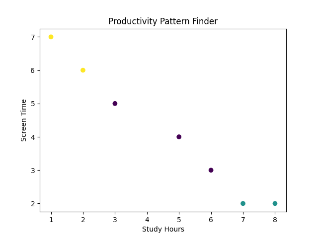

# Personal Productivity Pattern Finder

This is a beginner-friendly Machine Learning project that uses
K-Means clustering to analyze daily productivity data and identify
patterns such as high-focus days, average days, and distracted days.

## Problem Statement
Many people struggle to understand their productivity patterns.
This project helps identify different types of days based on daily
habits like study time, sleep, and screen usage.

## Solution
Using unsupervised machine learning (K-Means clustering), the project
groups similar days together without requiring labeled data.

## Technologies Used
- Python
- Pandas
- Scikit-learn
- Matplotlib

## How to Run
1. Install dependencies from `requirements.txt`
2. Run `python main.py`

## Output
- Clustered productivity patterns
- Visual scatter plot of study time vs screen time

## Learning Outcome
- Data preprocessing
- Unsupervised learning
- Data visualization
- ML project structuring
## Sample Output

